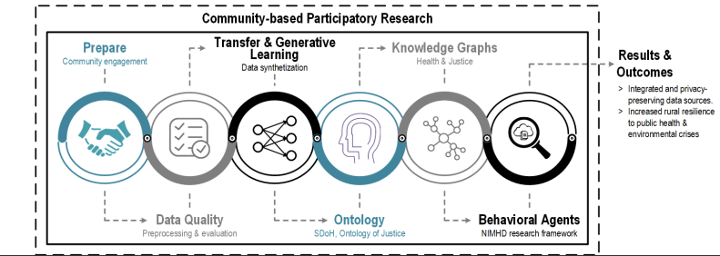

# Introduction 
Enhancing the resilience of our nation’s rural communities to existing and upcoming crises is of
pressing importance, as these areas are vital for preserving essential resources such as air quality,
water supplies, food production, and supply chains - a realization underscored by the CoVID19 pandemic. Following our preliminary work, we have pinpointed collaborators and mapped
out the capabilities required for rural resilience, particularly in the context of public health and
environmental crises. Central to these requirements of resources and community collaborations is
the ability to collect and analyze data related to health outcomes and climate changes, along with
social determinants of health and justice within rural locales.
Therefore, we have put together a specialized team that’s dedicated to overcoming difficulties
in data gathering and analysis. The method involves the construction of an extensive, interdisciplinary knowledge graph. This graph is designed to merge, portray, and interconnect previously
separate health and justice data sets. It’s a powerful resource designed to aid researchers, practitioners, and educators in improving their understanding of risk environments in rural locations and
strengthening their resilience. The project’s goal is to make use of existing geo-enrichment services
and initiatives like the NSF-funded KnowWhereGraph. The team is devoted to synchronizing our
efforts with these programs, as well as other Proto-OKN themes, in order to enhance our scientific
studies of rural resilience to public health and environmental crises.

## Project Overview

