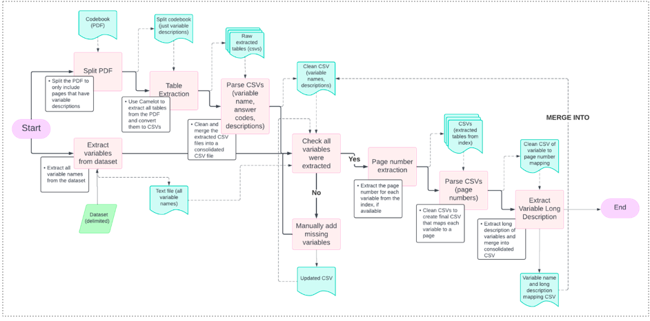

# PDF Table Parser

This project’s aim is to process each dataset’s documentation (i.e., usually termed the codebook or data dictionary) to parse out each variable in the dataset’s description, their possible answer categories/codes, and each code’s meaning.

## Table Extraction from PDF Pages into CSVs

### [camelot-pdf-extract-all-tables.py](https://github.com/SAIL-UA/OKN/blob/main/dataset/pdf-table-parser-main/camelot-pdf-extract-all-tables.py)

This code uses the Camelot library to extract tables from a specified PDF file using the stream mode, which is suitable for tables without borders. It specifies the pages to extract from and includes options to adjust edge tolerance and flag size. The script ensures specific columns in the extracted tables are converted to strings to prevent automatic date conversion, and then saves each table as a CSV file. Additionally, it prints the parsing report for each table to provide insight into the extraction process.

## Installation

### Set up Your Python Environment

Ensure you have Python installed on your system. It is recommended to use a virtual environment to avoid dependency conflicts.

```bash
python -m venv env
source env/bin/activate  # On Windows use `env\Scripts\activate`
```

### Install Dependencies

Install the required Python packages using pip. You can create a `requirements.txt` file with all dependencies or install them individually.

```bash
pip install camelot-py[cv] matplotlib
```

### Install GhostScript

GhostScript is required by Camelot to parse PDF files. Install it using Homebrew on macOS, or download and install it from the [official website](https://ghostscript.com/releases/gsdnld.html).

```bash
brew install ghostscript  # For macOS
```

### Verify GhostScript Installation

Ensure that Ghostscript is installed correctly by running:

```python
from ctypes.util import find_library
print(find_library("gs"))
```

## Example Usage

1. **Upload the PDF to be Parsed**
   - Place the PDF file you want to parse in the `pdfs` folder of your project directory.
   - [Example PDF](https://github.com/SAIL-UA/OKN/blob/main/dataset/pdf-table-parser-main/pdfs/NSSATS-2020-PUF-C.pdf)

2. **Modify the Page Range**
   - Change the `pages` parameter in the code to specify the range of pages you want to parse. This range should cover the sections with the variables you need.

3. **Run the Parsing Code**

   ```bash
   python3 camelot-pdf-extract-all-tables.py
   ```

4. **Check the Output**
   - The extracted tables will be saved as CSV files in the `csvs` folder with names like `spi_table_0.csv`, `spi_table_1.csv`, etc.
   - [Example Output](https://github.com/SAIL-UA/OKN/blob/main/dataset/pdf-table-parser-main/csvs/nhes_pfi_table_0.csv)

## Parsing CSVs into Formatted/Structured CSVs

### [parse_camelot_table_nhss.py](https://github.com/SAIL-UA/OKN/blob/main/dataset/pdf-table-parser-main/parse_camelot_table_nhss.py)

This code processes CSV files from a specified folder, extracting and parsing data to generate new CSV files with a structured format. It reads each CSV file into a pandas DataFrame, identifies variable names and descriptions, and extracts answer codes and their meanings. Each code for parsing CSVs will be dependent on the dataset’s codebook structure. This is a manual process of rewriting the code to parse for the specific items as previously mentioned. The parsed results are then converted to a DataFrame and saved as new CSV files. The script also includes error handling to skip files with missing required data and print the last processed DataFrame for verification.

## Usage Instructions

1. **Examine Parsed CSV Files**

    - Before running the script, you need to examine your parsed CSV files to identify any patterns in the data that can be used for extracting the variable names, descriptions, categories, and answer codes.

    - [Example CSV](https://github.com/SAIL-UA/OKN/blob/main/dataset/pdf-table-parser-main/csvs/nhes_pfi_table_0.csv)
    - For example, in this CSV, the variable name is “BASMID” and the description is “Unique child identifier”. There are no answer codes or answer meanings because it is a continuous variable.

2. **Open the Parsed CSV Files**

    - Navigate to the `csvs/raw_csvs` directory where your raw CSV files are stored. Open a few CSV files using a text editor or a spreadsheet application (e.g., Excel).

3. **Identify Patterns**

    - Look for consistent patterns in how the variable names, descriptions, categories, and answer codes are presented in the CSV files. Note any delimiters, keywords, or structural elements that can be used to reliably extract this information.

4. **Update the Parsing Code**

    - Based on the patterns identified, update the parsing code to accurately extract the required information from the CSV files.

5. **Modify the `parse_csv_data` Function**

    - Open or create a file named `parse_camelot_table_datasetname.py`, locate or create the `parse_csv_data` function, and update the logic within this function to handle the identified patterns.

### Install Dependencies

Ensure you have the necessary dependencies installed on your system.

### Run the Script

```bash
python3 parse_camelot_table_datasetname.py
```

### Verify the Output

The script will process each CSV file in the `csvs/raw_csvs` directory. It will generate new CSV files (`nmhss_parsed_table_1.csv`, `nmhss_parsed_table_2.csv`, etc.) in the same directory or specified output directory. Open these generated CSV files to verify the extracted data.

Follow these instructions to ensure accurate parsing and generation of structured CSV files for further ontology building processes. If you encounter any issues or need to make adjustments, revisit the patterns in your data and update the parsing logic accordingly.

## Merging CSVs

### [merge_parsed_csvs.py](https://github.com/SAIL-UA/OKN/blob/main/dataset/pdf-table-parser-main/merge_parsed_csvs.py)

This code merges multiple CSV files from a specified folder into a single CSV file. It reads each CSV file into a pandas DataFrame, concatenates all DataFrames into one, and saves the merged DataFrame as a new CSV file. The script also provides an option to print the merged DataFrame for verification.

## Usage Instructions

1. **Prepare Your CSV Files**

    - Ensure your CSV files are in the `csvs/parsed_csvs` directory within your project structure.

2. **Execute the Script**

    - Execute the script to merge the CSV files.

```bash
python merge_parsed_csv_files.py
```

3. **Verify the Output**

    - Check the merged CSV. The script will generate a merged CSV file (named how you have set the file to be named, e.g., `nsatts_2020_codebook.csv`) in the `csvs/clean_csvs` directory. Verify the merged DataFrame. The script optionally prints the merged DataFrame to the console. Review the output in the terminal to ensure that the data has been merged correctly.

    - [Example Output](https://github.com/SAIL-UA/OKN/blob/main/dataset/pdf-table-parser-main/csvs/clean_csvs/nmhss_2020_codebook.csv)

## Extracting Variable Names from File (CSV or TSV)

### [extract_variable_names_csv.py](https://github.com/SAIL-UA/OKN/blob/main/dataset/pdf-table-parser-main/extract_variable_names_csv.py)

This code extracts variable names (column names) from a specified CSV file and saves them to a text file. It reads the CSV file using pandas with a specified encoding, handles potential Unicode decode errors, and writes each variable name to a new line in the output text file. The script is designed to run as a standalone program when executed.

## Usage Instructions

1. **Prepare the CSV File**

    - Ensure your CSV file is located at the `datasets` folder within your project structure. If the file is located elsewhere, update the `csv_file_path` variable in the script accordingly.

2. **Run the Script**

- If your dataset is a CSV:

```bash
python3 extract_variable_names_csv.py
``` 
- If your dataset is a TSV:

```bash
python3 extract_variable_names_tsv.py
```

3. **Verify the Output**

    - The script will generate a text file named (something like `NHES_PFI_2019_variable_names.txt`) in the same directory as the script. Open the `NHES_PFI_2019_variable_names.txt` file and review the list of variable names to ensure they have been correctly extracted from the CSV file.

## Verifying if All Variables are Found in the New Merged CSV

### [verify_all_variables_extracted.py](https://github.com/SAIL-UA/OKN/blob/main/dataset/pdf-table-parser-main/verify_all_variables_extracted.py)

This code verifies if the variables listed in a text file are present in a specified column of a CSV file. It reads the variables from the text file and the unique values from the specified column in the CSV file. It then checks for any missing variables and prints the result, including the count of missing variables. This script ensures that all expected variables are present in the CSV file.

## Usage Instructions

1. **Prepare the Text File (List of Variable Names) and CSV File (Merged CSV)**

    - Use the text file generated with the `extract_variable_names_csv/tsv.py` script. Ensure your CSV file is located at `csvs/clean_csvs/` within your project structure.

    - If the file is located elsewhere, update the `csv_file_path` variable in the script accordingly.

2. **Run the Script**

    - Execute the script to verify the variables in the CSV file.

```bash
python3 verify_all_variables_extracted.py
```
3. **Verify the Output**

    - The script will print the results to the console. If any variables from the text file are missing in the CSV file, they will be listed along with the count of missing variables.

- Example output if variables are missing:

  ```
  The following variables are missing in the CSV file:
  variable1
  variable2
  Count: 2
  ```

- Example output if all variables are present:

  ```
  All variables from the text file are present in the CSV file.
  ```

4. **Manually Write in Missing Variables**

    - For each of the missing variables, locate them individually in the codebook, and manually add their information to the merged CSV. Else, you would need to rewrite the parsing code to catch all the variables that were missed.


## PDF Parser Diagram


