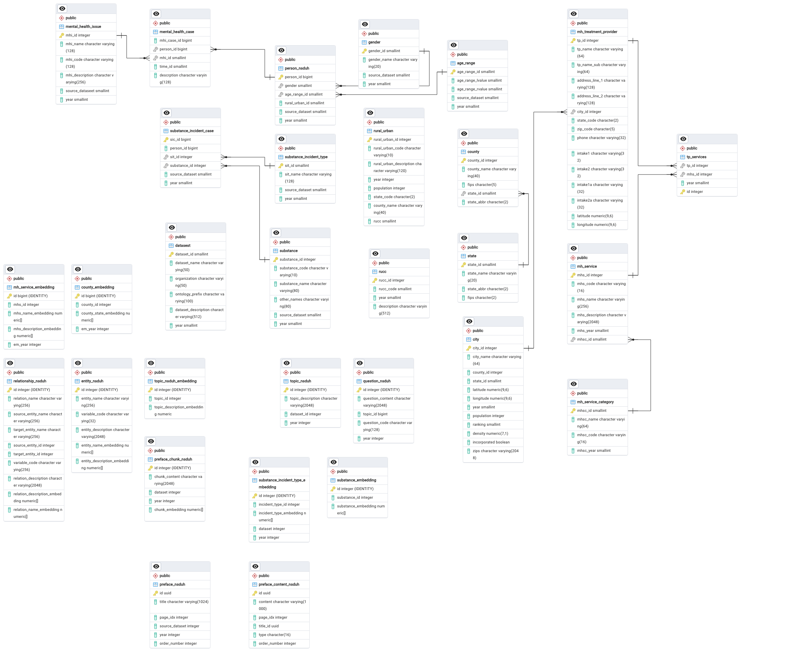

# Knowledge Graph Database

This section covers how to work with knowledge graph databases.

## Prerequisites

The following tools are essential for the design and construction of the Knowledge Graph Database:

- **PostgreSQL**: A relational database system used for storing the knowledge graph. For installation and usage instructions, please refer to the official documentation: [PostgreSQL Official Documentation](https://www.postgresql.org/download/).
  
- **pgAdmin 4**: A desktop administration tool for managing PostgreSQL databases. It offers an intuitive interface for tasks such as querying, schema management, and database maintenance. The built-in ERD (Entity-Relationship Diagram) tool is utilized for visualizing and designing the database schema.

Detailed database design can be accessed here: [NSDUH ERD V0.1](https://github.com/SAIL-UA/OKN/blob/main/database/ERD/database_v0_1.pgerd) (open with the pgAdmin 4 ERD tool).

The SQL statements for creating the tables are available here: [NSDUH SQL Statements for Table Creation](https://github.com/SAIL-UA/OKN/blob/main/database/ERD/okn_nsduh.sql).

> **Note:**  
> We are continuously introducing new datasets, and the database table design is evolving as well. The current version may not reflect the latest updates, but we will ensure continuous improvements and updates over time.

## Introduction

In this project, all Knowledge Graph components are maintained within a PostgreSQL database. There are three key considerations that led to the decision to adopt PostgreSQL for managing the Knowledge Graph:

1. **Dual functionality for knowledge representation and RAG queries**: The Knowledge Graph must support both knowledge representation and Retrieval-Augmented Generation (RAG) queries. A relational database is ideal for structuring the Knowledge Graph in our project. By aggregating triples from specific domains or categories into dedicated tables, we can follow a classic waterfall pattern for Knowledge Graph generation. Additionally, components such as chunks, entity descriptions, and more can be easily managed using the same relational database, allowing one backend database to serve both systems simultaneously.

2. **Long-term scalability and evolution**: The OKN project is designed to be a long-term initiative, with the Knowledge Graph expected to grow and evolve over time. As intermediate results are generated and analyzed for the continued development of the Knowledge Graph, a mature and stable database is necessary to manage fragmented data that may need refinement in future processes. PostgreSQL provides this stability and is well-suited to handling growing data volumes and complexity.

3. **Community support and alignment with other teams**: PostgreSQL boasts a strong and active community, and its use is widespread among other OKN teams. By adopting PostgreSQL for our Knowledge Graph, we simplify future collaboration and data alignment with other teams working on related projects.

## Targeted Dataset

Two types of datasets are central to our project: **survey** and **report** datasets. Both are published by reputable agencies or organizations. Currently, we have processed datasets like NSDUH (focused on substance abuse) and NIBRS (focused on justice), with plans to incorporate additional datasets as the project evolves.

As an example, consider the NSDUH (National Survey on Drug Use and Health) dataset, available at the official [NSDUH website](https://www.samhsa.gov/data/data-we-collect/nsduh-national-survey-drug-use-and-health). Conducted annually by the Substance Abuse and Mental Health Services Administration (SAMHSA), this survey provides nationally representative data on various topics including the use of tobacco, alcohol, and drugs; substance use disorders; mental health issues; and the receipt of substance use and mental health treatment. The survey covers the civilian, noninstitutionalized population aged 12 or older in the United States.

The NSDUH dataset offers two main resources:

1. **The Dataset**: This consists of the formatted survey results, where each row corresponds to a single, anonymous respondent's survey, and each column represents a question in the survey, encoded as a variable code.

2. **The Codebook**: This resource provides detailed explanations for each variable code, along with statistical summaries of the responses. The preface of the codebook also introduces foundational information about the survey, including statistical methods, relevant regulations, and policies related to security and privacy.

## Ontology and Knowledge Graph Generation

The codebook and dataset serve distinct purposes in the pipeline. The codebook provides the knowledge necessary for constructing the ontology, while the dataset supplies the data for populating the knowledge graph.

For example, consider the following variable (question) from the NSDUH Codebook 2022:

*"In the past 12 months, were you arrested and booked for driving under the influence of alcohol or drugs?"*

The entities extracted from this question might include:
- Respondent
- Alcohol
- Drug
- ArrestAndBooking
- SurveyPeriod
- DUI (Drive Under Influence)

The relationships between these entities may be represented as:
- (Respondent, DUI, Alcohol)
- (Respondent, ArrestAndBooking, Alcohol)
- (ArrestAndBooking, isRelatedTo, DUI)
- (DUI, involves, Alcohol)
- (DUI, involves, Drugs)
- (ArrestAndBooking, hasSurveyPeriod, SurveyPeriod)

These entity-relationship triples, along with their definitions, form the ontology. Guided by the ontology, relevant responses from the dataset are extracted to determine if a respondent engaged in certain behaviors. These responses form the triples in the populated knowledge graph.

## Database Design

The database design follows the Knowledge Graph (KG) paradigm, where entities and relationships are stored in dedicated tables. For example, substances mentioned in the codebook are stored in the **"substance"** table, and substance-related incident types are stored in the **"substance_incident_type"** table. Both of these tables are part of the ontology structure.

After retrieving relevant answers from the dataset, incidents involving anonymous respondents are inserted into the **"substance_incident_case"** table, which serves as the knowledge graph table, capturing real-world instances of the ontology.

The design for the NSDUH database is illustrated below:

You can find the raw PostgreSQL ERD design file at [NSDUH ERD V0.1](https://github.com/SAIL-UA/OKN/blob/main/database/ERD/database_v0_1.pgerd).

> **Note:**  
> In the current PostgreSQL database, we store embedding vectors for Retrieval-Augmented Generation (RAG) purposes. This is a temporary solution, and we are in the process of gradually migrating these vectors into the Milvus vector store.

## RDF Generation

With the Knowledge Graph maintained in PostgreSQL, it can be exported to various RDF formats, such as TTL (Turtle). The script for exporting the ontology can be found here: [TTL Export Script](https://github.com/SAIL-UA/OKN/blob/main/ontology/TTL/rucc_city_tp_levels_annotation.py).

The export process follows a waterfall pattern, where the entity tables are exported first, followed by the relationship tables, ensuring a systematic export of the Knowledge Graph.

## Graph Database

There are several excellent graph databases available, such as Neo4j. While we plan to integrate Neo4j into our future Retrieval-Augmented Generation (RAG) process, it is not part of the current implementation. 

The main reason for not using a graph database at this stage is that graph databases offer a high-level abstraction of the raw datasets and typically represent a more finalized state of the data. They lack the flexibility to evolve alongside the ongoing development process of the project, which is crucial at this phase.

Implementing graph database functionality within a relational database is not difficult. This can be achieved by adding an overlay table that records the type of each table—whether it represents an entity or a relationship. For example, as mentioned earlier, the **"substance"** table functions as an entity table, while the **"substance_incident_type"** table serves as a relationship table.

