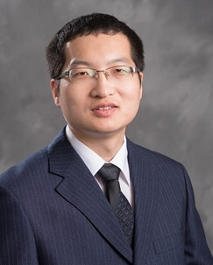

# Meet Our Team

Meet the members of our team working on the Rural Resilience Open Knowledge Graph project, including the principal investigator, co-principal investigators and student contributors.

## Project Principal Investigators (PIs) and Co-PIs

### PI: Dr. Jiaqi Gong

{: style="width:200px; height:200px;" }

#### Bio
Dr. Jiaqi Gong is ...

#### Website
[Visit Dr. Gong's Website](https://lidapeng.github.io/)

### Co-PI: Dr. Hee Yun Lee

{: style="width:200px; height:200px;" }

#### Bio
I am a Distinguished University Research Professor and tenured full professor at The University of Alabama School of Social Work, where I hold the Endowed Academic Chair in Social Work (Health) and serve as Co-Director of the Alabama Center for the Advancement of Artificial Intelligence. My research focuses on reducing health disparities in underserved and rural communities, driven by a commitment to translating evidence into actionable practice and policy to improve health outcomes and well-being. With a background as a behavioral health scientist and interventionist, I leverage technologies such as AI, Virtual Reality, Web Apps, and Sensors to promote health behavior change, and have developed eight technology-driven interventions that have been adopted in clinical practice and health insurance settings.

My work is funded by prominent federal agencies like the NIH, NSF, HRSA, SAMHSA, and CDC, and I currently lead six federally funded projects alongside five internally funded pilot initiatives. I employ a Community-Based Participatory Research approach to ensure that interventions are co-developed with community partners, users, and policymakers for practical implementation. Key projects include developing AI-powered digital therapy for dementia caregivers and creating an AI-enabled Open Knowledge Graph Network to address health disparities and substance misuse in rural areas. My global health efforts also address health disparities among marginalized populations in Korea, India, and Vietnam.

Throughout my career, I have been recognized with several prestigious awards, including the University Distinguished Research Professor title in 2024, the Blackmon-Moody Outstanding Professor Award, and the University of Alabama President’s Faculty Research Award. I have served in leadership roles, including as the inaugural Associate Dean for Research at UA and Director of Research at the University of Minnesota Twin Cities. My research lab, the HEAL Lab (Health Equity and Advancing Life through Technology), fosters the growth of undergraduate, graduate, and post-doctoral scholars, who collaborate with international partners to advance research in social work and health disparities.

#### Website
[Visit Dr. Lee's Website](https://socialwork.ua.edu/blog/lee-hee-yun/)

### Senior Personnel: Dr. Dapeng Li

{: style="width:200px; height:200px;" }

#### Bio
Dr. Dapeng Li is an Assistant Professor in the Department of Geography and the Environment at the University of Alabama. He has a long-running research interest in using geospatial technologies to save lives and property in disasters. My current research primarily focuses on: 1) data-driven evacuation modeling and planning; 2) Web GIS applications in wildfire evacuation, public health, and agriculture; and 3) wildfire risk modeling and mapping. As a certified GIS Professional (GISP), I am dedicated to educating the next generation of GIS professionals at the University of Alabama and helping them succeed in their careers.

#### Website
[Visit Dr. Li's Website](https://lidapeng.github.io/)

## Student Members

### Student: Xiaoming Guo

{: style="width:200px; height:200px;" }

#### Bio
Xiaoming Guo is a Ph.D. student in the Department of Computer Science at the University of Alabama. His research focuses on technologies in Large Language Models, Knowledge Graphs, and smart transportation systems. With a background in software engineering from Huazhong University of Science and Technology, he has extensive experience in both academic research and industry roles. His current work includes building the infrastructure for the OKN project, where he designs and develops robust database and front-end systems. Xiaoming's expertise spans relational and graph databases, Python, and Java development.

### Student: Xishi(Ethan) Zhu

{: style="width:200px; height:200px;" }

#### Bio
Xishi (Ethan) Zhu is a PhD student in the Department of Computer Science at the University of Alabama. His research centers on applied machine learning across fields such as behavioral science, health informatics, and smart, connected health. Currently, he is focusing on leveraging large language models (LLMs) to transform unstructured data in health and justice domains into structured knowledge graphs and expert-informed ontologies. This work aims to assist social workers and clinicians in making more informed decisions efficiently and effectively, particularly in studying health-related behaviors such as substance abuse.

#### Website
[Visit Ethan's Website](https://www.linkedin.com/in/xishi-ethan-zhu/)

### Student: Ryan Henry

{: style="width:200px; height:200px;" }

#### Bio
Currently a PhD student at the University of Alabama studying large language models and knowledge graphs. Has a Master’s Degree in Electrical Engineering from the University of Florida. Worked as a Systems Engineer for 5 years at Lockheed Martin.

#### Website
[Visit Ryan's Website](https://www.linkedin.com/in/ryan-henry-6b92ba127)
### Student: Shenglin Li

{: style="width:200px; height:200px;" }

#### Bio
Shenglin (Shane) Li received the PhD degree in Mechanical Engineering at The University of Alabama. His research focuses on advanced applications of AI, including multi-camera vehicle tracking, sensor fusion, and computer vision on NVIDIA hardware. He has extensive experience with machine learning algorithms such as YOLO and DEEPSORT, and his work has resulted in significant improvements in vehicle localization and tracking. Currently, he is working as a post-doctoral researcher at the SAIL Lab, where he is modeling data storytelling as a combinatorial search problem to enhance scientific creativity.

#### Website
[Visit Shenglin's Website](www.linkedin.com/in/shenglin-li)

### Student: Andres Ramirez Molina

{: style="width:200px; height:200px;" }

#### Bio
Andrés Ramírez Molina is a PhD student in the Department of Computer Science at The University of Alabama. He specializes in integrating Data Science, Machine Learning, and Artificial Intelligence with environmental science. Andrés holds a Bachelor’s in Electrical Engineering and a Master’s in Political Science, bringing over 18 years of diverse experience across various continents and industries. His unique skillset has led him to roles where technology intersects with public administration and innovation to address complex social issues. Currently, Andrés’ research focuses on exploring synergies between large language models (LLMs) and hydrological science to improve the identification of research-to-operation gaps and enhance decision-making in water resource management. He also utilizes deep neural networks to create synthetic streamflow data for unmonitored river segments, aiming to enhance flood risk management and water resource allocation in regions lacking physical gauge networks. Additionally, he employs advanced machine learning techniques to reconstruct past climatological patterns using tree-ring data. The principal objective of his research is to enhance our understanding of historical climate dynamics and their influence on regional hydrology, thereby facilitating improved forecasting and strategic resource management to effectively address climatic variations and their consequences on water availability and ecosystem well-being.

#### Website
[Visit Andres's Website](https://aaramirez.myportfolio.com)

## Postdoctoral Members

### Post-doc: Chen Wang

{: style="width:200px; height:200px;" }

#### Bio
Chen Wang earned her B.S. degree in Computer Science from the University of Jinan in 2017 and completed her Ph.D. in Computer Science at The University of Alabama in 2023. Currently a Postdoctoral Researcher at UA, her work focuses on interdisciplinary research, particularly enhancing the sensitivity of AI technologies to social and ethical issues in areas such as smart healthcare, education, and engineering.

#### Website
[Visit Chen's Website](https://www.linkedin.com/in/cwang86/)