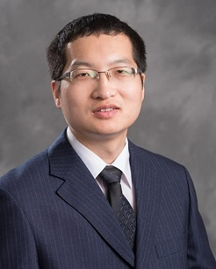

# Meet Our Team

## Project Principal Investigators (PIs)

### PI: Dr. John Doe

#### Bio
Dr. John Doe is the lead investigator on this project. His research focuses on rural ontologies and the use of AI in knowledge graph construction...

#### Website
[Visit John's Website](https://lidapeng.github.io/)

## Student Members

### Student: Jane Smith

#### Bio
Jane Smith is a PhD student working on the ontology construction portion of the project. Her interests lie in machine learning and semantic technologies...

#### Website
[Visit Jane's Website](https://lidapeng.github.io/)

# Other Members
...
